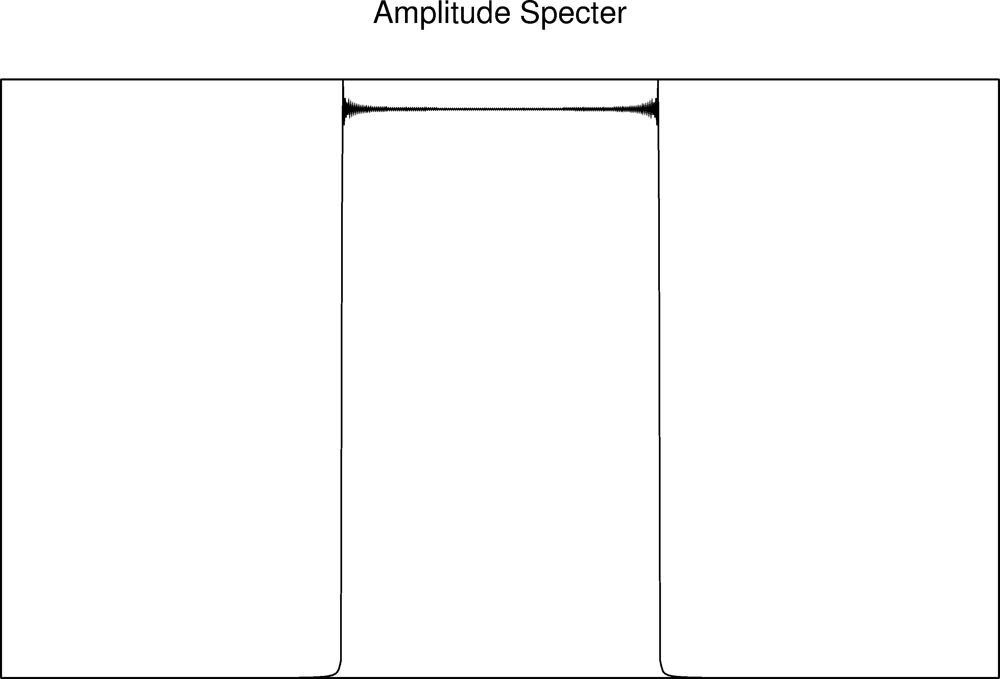

# Discrete Fourier Transform in C

A C implementation of the Discrete Fourier Transform that I made in 2007 for a
class in signal processing. It should compile with GCC. The plotting scripts
included use GMT and might not work with newer versions (GMT5+).

This is an example of the amplitude spectrum calculated for the data in
`sample-function.txt`:

## License

This is free software: you can redistribute it and/or modify it under the
terms of the **BSD 3-clause License**. A copy of this license is provided in
`LICENSE.txt`.
